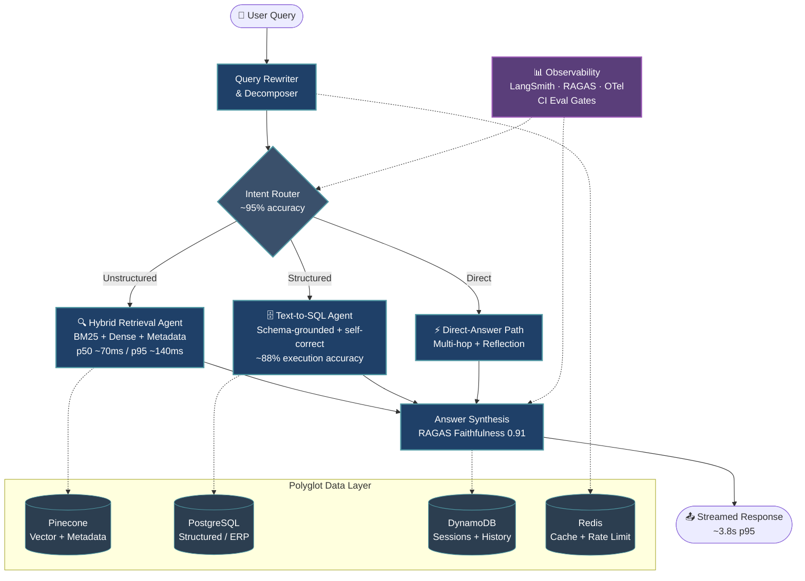

<div align="center">


<br/>

<p>
<a href="https://www.linkedin.com/in/maharana-sunil"></a>
<a href="mailto:maharanasunil1843@gmail.com"></a>
<a href="https://huggingface.co/maharanasunil1843"></a>
<a href="https://twitter.com/maharanasunil18"></a>
</p>

<p>


</p>

</div>

---

## 👤 About

I'm a **Lead AI Engineer** who entered the field through operations and built a manufacturing enterprise's entire production AI capability **end-to-end** — agents, retrieval, datastores, evaluation, infrastructure, and the user-facing product — as the **sole technical owner**, while completing a CS degree alongside full-time work.

**8+ years** of professional experience · **~4 years** shipping and operating production GenAI. I owned the highest-risk technical core directly and **directed a rotating set of specialist freelance engineers (1–3 at a time)** across deployment, production pipeline, and integration — running structured trade-off reviews and documenting decisions before execution.

I own the whole system: the agentic workflow, the polyglot data layer, the observability, the AWS pipeline, and the chat application on top.

> **Sugna Metals Ltd.** — ₹600 Cr steel manufacturing enterprise, Hyderabad
> Sole designer, builder and operator of the company's entire production GenAI capability — with no permanent AI team.

---

## 📊 At a Glance

<div align="center">

<table>
<tr>
<td align="center" width="25%">
<h2>~45K</h2>
<sub><b>LLM QUERIES / MONTH</b></sub><br/>
<sub>~2K/day · 50+ users</sub>
</td>
<td align="center" width="25%">
<h2>99.5%</h2>
<sub><b>ROLLING AVAILABILITY</b></sub><br/>
<sub>Production, single operator</sub>
</td>
<td align="center" width="25%">
<h2>₹6.8 Cr</h2>
<sub><b>RISK + SAVINGS IMPACT</b></sub><br/>
<sub>Audited business impact</sub>
</td>
<td align="center" width="25%">
<h2>~₹1.4</h2>
<sub><b>BLENDED COST / QUERY</b></sub><br/>
<sub>Routing + prompt caching</sub>
</td>
</tr>
</table>

</div>

---

## 🧠 The System I Built

A natural-language interface over the enterprise's structured *and* unstructured data — every query is rewritten, decomposed, intent-classified, and routed to the right specialist agent, with per-hop tracing wired into CI eval gates.



---

## 🚀 Flagship Projects

### 1. Agentic Enterprise Knowledge Platform
<sub>`PRODUCTION` · `SOLO-LED` · `~45K queries/month`</sub>

Natural-language interface over the enterprise's structured *and* unstructured data — across procurement, operations, and audit.

<details open>
<summary><b>Architecture & Engineering Details</b></summary>

<br/>

**Agentic Core** — Every query is rewritten, decomposed, and intent-classified. A router delegates to:
- 🔍 **Hybrid-Retrieval Agent** — multimodal embeddings + rich metadata; BM25 + dense + metadata-filtered
- 🗄️ **Text-to-SQL Agent** — generates and self-corrects queries against the operational store
- ⚡ **Direct-Answer Path** — multi-hop, with reflection and answer synthesis across hops

**Data Layer** — Polyglot by design: vector store (embeddings + metadata), SQL (ERP / operational), NoSQL (sessions + conversation history), Redis (cache + rate limit).

**Product** — Modern streaming chat client: auth (login/logout), persisted session history with resume + delete, per-message trace surfacing.

**Observability** — Per-hop tracing on functional metrics (faithfulness, routing accuracy, SQL execution correctness) and non-functional ones (per-hop latency, token cost, cache hit, error rate), wired into CI eval gates.

```text
Stack  LangGraph · GPT-5.x · Claude Sonnet 4.6 / Haiku 4.5 · Multimodal Embeddings
       Pinecone · PostgreSQL · DynamoDB · Redis · FastAPI · React / Next.js
       LangSmith · RAGAS · AWS (Lambda / ECS / S3 / Cognito) · GitHub Actions
```

</details>

<table>
<tr>
<th align="left">Metric</th>
<th align="left">Value</th>
</tr>
<tr><td>Retrieval p50 / p95</td><td><code>~70 ms / ~140 ms</code></td></tr>
<tr><td>Answer p95</td><td><code>~3.8 s</code></td></tr>
<tr><td>RAGAS Faithfulness</td><td><b>0.91</b></td></tr>
<tr><td>RAGAS Answer-Relevancy</td><td><b>0.88</b></td></tr>
<tr><td>Intent-Routing Accuracy</td><td><b>~95%</b></td></tr>
<tr><td>Text-to-SQL Execution Accuracy</td><td><b>~88%</b> <sub>(with self-correction retry)</sub></td></tr>
<tr><td>Audited Hallucination Rate</td><td>~23% → <b>~6%</b></td></tr>
<tr><td>Blended Cost</td><td><b>≈ ₹1.4 / query</b> <sub>(~₹70K/month at scale)</sub></td></tr>
<tr><td>SOP Retrieval Time</td><td>~12 min → <b>~80 s</b></td></tr>
</table>

---

### 2. Agentic Procurement Negotiator
<sub>`IN ACTIVE DEVELOPMENT` · `SUPERVISOR PATTERN` · `HUMAN-IN-THE-LOOP`</sub>

Multi-agent system that ingests vendor offers, scores them against risk and historical pricing pulled across the polyglot stores, and drafts counter-positions and contracts behind a **human approval gate**.

<details open>
<summary><b>Architecture & Engineering Details</b></summary>

<br/>

**Supervisor pattern** (`langgraph-supervisor` / `create_supervisor()`)

- Orchestrator with route/finish-only control delegates to **4 specialists**: offer analysis, pricing intelligence (text-to-SQL over historical data), risk, contract drafting
- Tool-based handoffs via `Command(goto, graph=PARENT)`
- Postgres-checkpointed shared state keyed by `thread_id`
- Recursion / handoff guard · routing-accuracy evaluator gating CI · MCP tool layer · human-in-the-loop interrupts · `.astream()` streaming

```text
Stack  LangGraph + langgraph-supervisor · Claude Opus 4.7 (planning) + Haiku 4.5 (workers)
       MCP · PostgreSQL + DynamoDB · LangSmith · RAGAS + LLM-as-judge
       FastAPI · React / Next.js · AWS · GitHub Actions
```

</details>

<table>
<tr>
<th align="left">Metric</th>
<th align="left">Value</th>
</tr>
<tr><td>Routing Accuracy</td><td><b>~95%</b></td></tr>
<tr><td>Tool-Call Correctness</td><td><b>~92%</b> <sub>(labelled task set, scored in CI)</sub></td></tr>
<tr><td>Cost per Negotiation Session</td><td><b>≈ ₹22</b> <sub>(Opus for planning only, Haiku workers)</sub></td></tr>
<tr><td>Target Cycle Reduction</td><td><b>~30%</b> <sub>(~14 → ~9.5 days) — validated in eval, not yet production-claimed</sub></td></tr>
</table>

---

## 💼 Business Impact

<div align="center">

<table>
<tr>
<td align="center" width="33%">
<h3>₹3.2 Cr</h3>
<sub><b>VENDOR FRAUD PREVENTED</b><br/>Year 1 · XGBoost<br/>Precision 0.98 · ROC-AUC 0.97</sub>
</td>
<td align="center" width="33%">
<h3>₹5.6 Cr</h3>
<sub><b>INVENTORY UNBLOCKED</b><br/>ABC–XYZ analysis<br/>on live ERP feed</sub>
</td>
<td align="center" width="33%">
<h3>~30 hrs/wk</h3>
<sub><b>MANUAL REPORTING REMOVED</b><br/>Automated analytics pipelines</sub>
</td>
</tr>
<tr>
<td align="center">
<h3>~12 min → 80 s</h3>
<sub><b>SOP RETRIEVAL TIME</b></sub>
</td>
<td align="center">
<h3>~3 days → 2 hrs</h3>
<sub><b>PO–INVOICE MATCHING</b></sub>
</td>
<td align="center">
<h3>~23% → ~6%</h3>
<sub><b>AUDITED HALLUCINATION RATE</b></sub>
</td>
</tr>
</table>

</div>

---

## 🛠️ Technical Architecture

<table>
<tr>
<td valign="top" width="50%">

**🤖 Agentic**
LangGraph · langgraph-supervisor · query rewriting & decomposition · intent routing · multi-hop synthesis · MCP · human-in-the-loop · Postgres checkpointing

**🔍 Retrieval**
Hybrid BM25 + dense + metadata-filtered · multimodal embeddings · cross-encoder & Cohere re-ranking · parent-document & semantic chunking

**🗄️ Text-to-SQL**
NL→SQL generation with schema grounding · validation and self-correction retry loop over the operational store

**🧬 Models**
GPT-5.x · Claude Opus 4.7 / Sonnet 4.6 / Haiku 4.5 · Gemini 3.x · Llama 4 / DeepSeek (routing) · text-embedding-3-large · BGE / E5

**📐 Eval & Quality**
RAGAS (faithfulness, relevancy, context precision/recall) · LLM-as-judge · routing-accuracy & SQL-correctness evals · golden sets · CI eval gates

</td>
<td valign="top" width="50%">

**🗃️ Data Layer**
Pinecone / pgvector (embeddings + metadata) · PostgreSQL (structured / text-to-SQL) · DynamoDB / MongoDB (sessions, history) · Redis (cache, rate limiting)

**⚙️ LLMOps**
Docker · MLflow · DVC · GitHub Actions · LangSmith / Langfuse · OpenTelemetry GenAI · Prometheus · Grafana · Terraform

**☁️ Cloud / Product**
AWS (Lambda · ECS/Fargate · S3 · IAM · ALB · Cognito · CloudWatch) · FastAPI (async + SSE) · React / Next.js chat client with auth + session management

**🛡️ Security**
LLM Guard · prompt-injection & PII defenses · RBAC · audit logging · secrets management

**💻 Languages**
Python (primary) · SQL · Bash · JavaScript / TypeScript · C++

</td>
</tr>
</table>

<p align="center">

</p>

---

## 💼 Experience

**Sugna Metals Ltd.** — ₹600 Cr steel manufacturing enterprise, Hyderabad

<details open>
<summary><b>🟢 Lead AI Engineer — GenAI & LLMOps</b> &nbsp;·&nbsp; <i>titled AI Architect; sole technical owner</i> &nbsp;·&nbsp; <code>Nov 2021 – Present</code></summary>

<br/>

- **Sole designer, builder and operator** of the company's entire production GenAI capability — agentic workflows, polyglot data layer, evaluation, AWS pipeline and the chat product — with no permanent AI team.
- Owned the highest-risk technical core (agentic architecture and orchestration) end-to-end; **directed a rotating set of specialist freelance engineers (1–3 concurrent, engagements from a few months to ~a year)** across deployment, production pipeline, and integration — running structured trade-off reviews and documenting decisions before execution.
- Built the agentic core: query rewriting / decomposition, intent classification, and a router that delegates between hybrid retrieval, text-to-SQL, and direct-answer paths with multi-hop synthesis.
- Stood up the full **LLMOps and observability baseline** alone: DVC · MLflow · LangSmith / OpenTelemetry GenAI tracing on functional + non-functional metrics · CI eval gates (GitHub Actions) · containerized AWS deploys · Prometheus / Grafana alerting.
- Engineered the **security and product layer** — LLM Guard prompt-injection / PII defenses, RBAC, audit logging, auth and session management in the chat client.
- Own every architectural trade-off and keep the stack current — e.g., adopting the LangGraph supervisor pattern and current GPT-5 / Claude 4.x model routing as they became production standard.
- Productionized an **XGBoost vendor-fraud detection system** (precision 0.98, recall 0.91, ROC-AUC 0.97), preventing **₹3.2 Cr in fraudulent vendor payments** in year one.
- Deployed a **BERT-based NLP service** for production-delay classification (FastAPI on AWS Lambda); automated analytics pipelines that removed **~30 hours/week of manual reporting**.

</details>

<details>
<summary><b>🟡 Procurement Manager — Technology & Analytics Enablement</b> &nbsp;·&nbsp; <code>Jan 2020 – Oct 2021</code></summary>

<br/>

- Built and owned the technology / analytics roadmap inside procurement; the bridge role that turned operational pain points into automation specs and seeded the AI capability that followed.
- Designed and deployed automation across procurement workflows that compounded into the **₹5.6 Cr inventory and ~30 hrs/week reporting** gains.

</details>

<details>
<summary><b>🟡 Analytics & Automation Executive — Procurement</b> &nbsp;·&nbsp; <code>Nov 2017 – Dec 2019</code></summary>

<br/>

- Entry role taken out of financial necessity; turned it into a launchpad.
- Built **real-time inventory dashboards on a live ERP feed** (ABC–XYZ analysis contributed to **₹5.6 Cr less blocked inventory**).
- Automated **PO–invoice matching** (~3 days → **~2 hours**).

</details>

---

## 🎓 Education & Certifications

**B.Tech, Computer Science** — Osmania University (affiliated college), Hyderabad &nbsp;·&nbsp; *2018 – 2022*

> Completed full-time while employed at Sugna Metals via a working-professional program. **Final-year project:** the company's first production RAG system on AWS — the seed of the platform above.

**Certifications (IBM):** Machine Learning with Python · Data Science Methodology · Python for Data Science

---

## 🧭 How I Think

```text
┌─────────────────────────────────────────────────────────────────┐
│  1. Ship to production. A demo isn't a system.                  │
│  2. Measure everything that moves — and gate CI on it.          │
│  3. Own the trade-offs. Document the decision, not the outcome. │
│  4. Right model for the job. Opus to plan, Haiku to do.         │
│  5. The polyglot data layer is the moat, not the LLM.           │
└─────────────────────────────────────────────────────────────────┘
```

---

## 📈 GitHub

<div align="center">

<a href="https://github.com/maharanasunil1843">

</a>
<a href="https://github.com/maharanasunil1843">

</a>

<br/>


</div>

---

<div align="center">

### *"Ship production AI. Own the architecture. Measure everything that moves."*

<br/>


<br/><br/>


</div>
